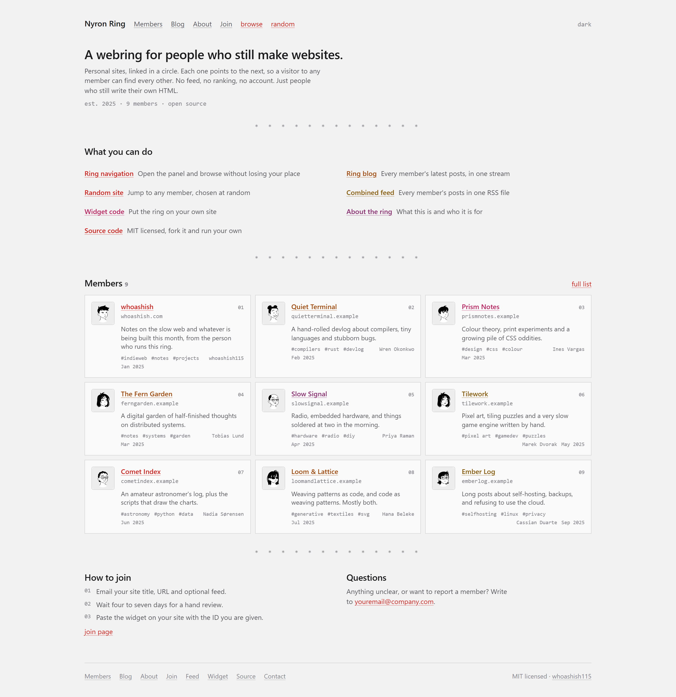
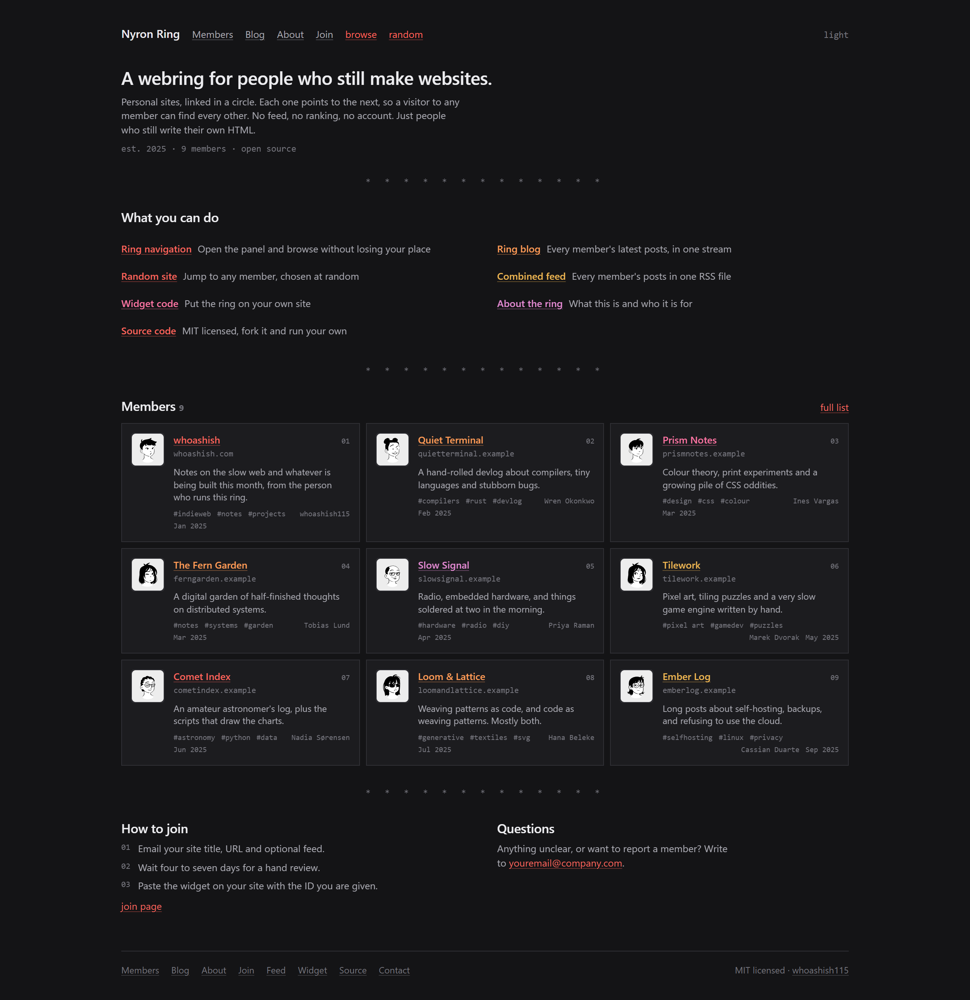

# Nyron Ring

An open source **webring template**. Fork it, edit one folder, and you are
running your own ring: personal, hand-made sites linked in a circle, so a
visitor to one can find all the others. No algorithm decides who you see next.
The ring does.

Nyron Ring is the reference deployment, aimed at computer science enthusiasts.



<details>
<summary>Dark mode</summary>



</details>

## What a webring is

A group of independent sites each show a small widget with `prev`, `random` and
`next` links. Follow `next` far enough and you come back where you started.
There is no central feed, no ranking, and no account. Just sites pointing at
each other.

Nyron Ring is one such ring, plus the site that runs it.

## Features

- **Member directory** with search and topic filtering
- **Combined blog** gathering every member's RSS into one stream
- **Ring navigation panel**, a popup that drives the window behind it
- **Embeddable widget** with permanent member IDs
- **Combined RSS feed** at `/rss.xml`
- Light and dark themes. No web fonts, no icon library, no analytics
- Server-rendered, with full metadata, sitemap, robots and JSON-LD

## Run it

Requires Node.js 20 or newer.

```bash
npm install
```

```bash
npm run dev
```

Open <http://localhost:3000>. To check a production build:

```bash
npm run build && npm start
```

## Editing the site

Everything lives in [`src/data/`](src/data). No component hardcodes a
user-facing string, so you never edit JSX to rebrand or re-word anything.

| File | What it holds |
| --- | --- |
| [`config.js`](src/data/config.js) | Ring name, URL, contact email, author, licence, colours |
| [`sites.js`](src/data/sites.js) | The member list, the ring itself |
| [`content.js`](src/data/content.js) | Every string the site renders, down to form labels |
| [`navigation.js`](src/data/navigation.js) | Top links, footer links, the "what you can do" list |

Adding a page to `navigation` also adds it to the sitemap. Colours live as CSS
custom properties in [`globals.css`](src/styles/globals.css), defined once for
light and once for dark. `src/lib/` holds logic only: feeds, metadata, the
widget snippet, avatars, accent classes.

### Adding a member

Append to `siteList` in `src/data/sites.js` with the next unused `id`:

```js
{
  id: 10,
  title: "Example Site",
  website: "https://example.com",
  owner: "Someone",
  blurb: "One line about what is on the site.",
  tags: ["notes", "css"],
  accent: "rust",                      // crimson | rust | rose | ember | plum
  avatar: avatarFor("someone"),        // or a path under /public
  rss: "https://example.com/feed.xml", // optional, feeds the blog
  joined: "2025-06-01",                // optional
}
```

**Never reuse or renumber an `id`.** Members embed theirs in the widget on
their own site, so renumbering would silently break their links. Deleting an
entry is safe; the remaining IDs stay valid.

The member whose `owner` matches `config.author.name` is shown as the ring
owner above the list, and left out of the list itself so nobody appears twice.

> The members shipped here are **placeholders**: invented people on invented
> `.example` domains, so the layout can be seen with a full ring. Delete them
> before you launch.

## How it works

### The ring

Each member's widget links to `/ring/browse`, which resolves their `id` to a
position and redirects to their neighbour:

```
GET /ring/browse?action=next&current=7    ->  302 to the site after member 7
GET /ring/browse?action=prev&current=7    ->  302 to the site before member 7
GET /ring/browse?action=random&current=7  ->  302 to any other member
```

`current` is an **ID, not a position**, so a member's embedded widget keeps
working as others join or leave.

### The navigation panel

`/widget` is a popup opened by the `browse` link at the top of every page. It
drives the window that launched it, so the panel stays on screen while member
sites load behind it. It offers `prev`, `random`, `next`, a position counter
and a jump-to list. Opened directly it navigates itself instead, and says so.
It never moves anything until you press something.

### The blog

`/blog` reads every member's RSS and shows their recent posts as one stream.
`/rss.xml` publishes the same thing as a feed. Both go through
[`src/lib/feeds.js`](src/lib/feeds.js), so they cannot disagree. Feeds are
fetched in parallel with an eight second timeout, a dead feed is skipped rather
than fatal, and the result is cached for an hour.

A member appears there as soon as their entry has an `rss` URL.

### The widget

Members paste this in, replacing `YOUR_ID`. The join page generates it for them.

```html
<link rel="stylesheet" href="https://your-ring.example/webring.css">
<div class="webring">
  <a class="webring-logo" href="https://your-ring.example/">
    
  </a>
  <nav class="webring-nav">
    <a href="https://your-ring.example/ring/browse?action=prev&amp;current=YOUR_ID">prev</a>
    <a href="https://your-ring.example/ring/browse?action=random&amp;current=YOUR_ID">random</a>
    <a href="https://your-ring.example/ring/browse?action=next&amp;current=YOUR_ID">next</a>
  </nav>
</div>
```

`webring.css` is scoped entirely under `.webring` and uses `currentColor`, so it
inherits the host page's text colour instead of fighting its design.

### Avatars

Portraits are generated by [DiceBear](https://dicebear.com) from a seed, so
there are no image files to manage. They are fetched from `api.dicebear.com` by
the visitor's browser; to avoid that, download the SVGs into `public/avatars/`
and point `avatar` at them instead.

## Layout

```
src/
  app/
    (site)/          Public pages: home, members, blog, about, join
    widget/          Ring navigation panel (noindex)
    ring/browse/     Redirect endpoint members' widgets point at
    rss.xml/         Combined member feed
    robots.js        sitemap.js  manifest.js  opengraph-image.js
  components/        Presentational, grouped by page
  data/              All content and configuration
  lib/               feeds, metadata, widget, avatars, accents
  styles/            Design tokens and base styles
public/              Icons and webring.css served to members
```

Pages are server-rendered, so content is in the HTML for crawlers and for
readers without JavaScript. The only client components are the theme toggle,
the member search, the join form, the copy button and the navigation panel.

Every page carries a canonical URL, description, Open Graph and Twitter tags,
and a generated social image. The site ships `robots.txt`, a sitemap, a web app
manifest, and JSON-LD for the site, the member list and the blog. The panel and
the redirect endpoint are `noindex`.

## Joining

Use the join page, or email the address in `src/data/config.js` with your site
title, URL and optionally an RSS feed. Submissions are reviewed by hand, so
expect a reply within four to seven days.

Anyone is welcome. Harassment or discrimination of any kind means removal.

## Contributing

Issues and pull requests are welcome: bug fixes, accessibility improvements and
documentation especially. To propose your own site, use the join page rather
than a pull request, so IDs are assigned in one place.

## Built with

[Next.js](https://nextjs.org) (App Router) · [React](https://react.dev) ·
[Tailwind CSS v4](https://tailwindcss.com) ·
[next-themes](https://github.com/pacocoursey/next-themes)

## License

[MIT](LICENSE) © whoashish115
