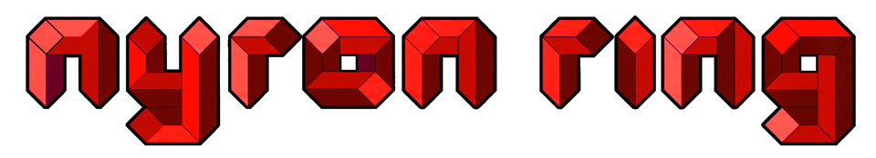
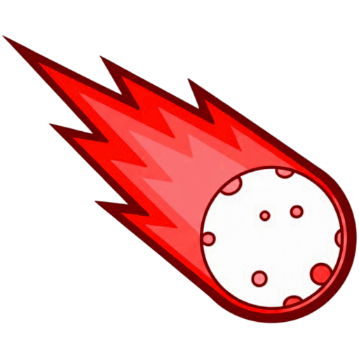

# Nyron Ring

An open source **webring template**. Fork it, edit one folder, run your own
ring: personal sites linked in a circle, each pointing at the next. No
algorithm picks what you see, the ring does.


<details>
<summary>Dark mode</summary>


</details>

## Features

- **Member directory** with search and topic filtering
- **Ring navigation popup** that drives the window behind it
- **Combined blog + RSS feed** at `/blog` and `/rss.xml`
- **Embeddable widget** with permanent member IDs
- **One folder to edit**, no component hardcodes a string
- Light + dark themes, no web fonts, no icon library, no analytics
- Server-rendered, with metadata, sitemap, robots + JSON-LD

## Getting started

Needs Node.js 20+.

```bash
npm install
npm run dev
```

**Configuration.** Everything lives in [`src/data/`](src/data):

| File | Holds |
| --- | --- |
| [`config.js`](src/data/config.js) | Name, URL, contact email, author, licence, colours |
| [`sites.js`](src/data/sites.js) | The member list, the ring itself |
| [`content.js`](src/data/content.js) | Every string the site renders |
| [`navigation.js`](src/data/navigation.js) | Top links, footer links, actions |

**Adding a member.** Append to `siteList` in `src/data/sites.js`:

```js
{
  id: 10,
  title: "Example Site",
  website: "https://example.com",
  owner: "Someone",
  blurb: "One line about what is on the site.",
  tags: ["notes", "css"],
  accent: "rust",                      // crimson | rust | rose | ember | plum
  avatar: avatarFor("someone"),        // or a path under /public
  rss: "https://example.com/feed.xml", // optional, feeds the blog
  joined: "2025-06-01",                // optional
}
```

**The widget.** Members paste this in, replacing `YOUR_ID`. The join page
generates it for them:

```html
<link rel="stylesheet" href="https://your-ring.example/webring.css">
<div class="webring">
  <a class="webring-logo" href="https://your-ring.example/">
    
  </a>
  <nav class="webring-nav">
    <a href="https://your-ring.example/ring/browse?action=prev&amp;current=YOUR_ID">prev</a>
    <a href="https://your-ring.example/ring/browse?action=random&amp;current=YOUR_ID">random</a>
    <a href="https://your-ring.example/ring/browse?action=next&amp;current=YOUR_ID">next</a>
  </nav>
</div>
```

<p>
  
  &nbsp;&nbsp;&nbsp;
  
</p>

## License

[MIT](LICENSE) © whoashish115
